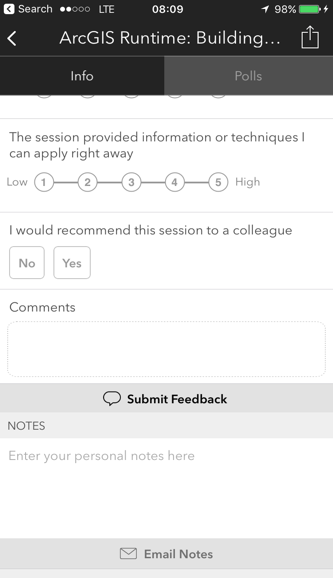

<!-- .slide: data-background="../reveal.js/img/title.png" class="center" -->

# Deep Dive on How ArcGIS API for JavaScript Widgets Were Built

### Matt Driscoll – [@driskull](https://twitter.com/driskull)
### JC Franco – [@arfncode](https://twitter.com/arfncode)

---

# Agenda

- History
- Accessor
- TypeScript
- Lifecycle
- Porting
- Tools
- Resources
- Q & A

---

# History

- Dijit to now
- Why we changed
- What we gain

---

# Accessor

TBD

---

# TypeScript

- Leverage ES6 (syntactic sugar)
- Interfaces
- Typing
- const and let vs var
- remove binding for () => {}

---

# Internal development lifecycle

TBD? JC?

---

# Porting

Go through all the things we do to port a widget to 4x.

Let's go deep!

---

# Porting: Real Nodes

---

# Porting: JSX

- focusing nodes
  - storing reference to them
- Using JSX to hide nodes
  - toggling classes
  - joining classes
  - using es6 templates
  - JSX key attribute
  - accessibleHandler
  - JSX storing data on attributes

---

# Porting: ViewModels

- Rethinking APIs
  - More collections
  - More Accessors
  - View properties instead of events
  - readonly properties
- Support modules
  - Offloading logic where appropriate. More modular
- Autocasting

---

# Porting: Styling

- CSS to Sass
  - Variables
  - Theming
  - Mixins
  - etc.
- BEM
- Icon font / SVG
- Organized class names, CSS object

---

# Tools

- IDEs
- NPM
- Grunt

---

# Tools: IDEs

- Visual Studio Code
- WebStorm

---

# Tools: Node

- Node
- NPM

---

# Tools: Tasks

- Grunt

---

## Additional Resources

- [JavaScript Sessions at DevSummit](https://devsummit.schedule.esri.com/#search/sessions/q:javascript)
- [Documentation - 4.3](https://developers.arcgis.com/javascript/)

---

# Use the source luke

[GitHub Code](https://github.com/jcfranco/dev-summit-2017-widgets-deep-dive)

---

# Please Take Our Survey!

1. Download the Esri Events app and go to DevSummit
2. Select the session you attended
3. Scroll down to the "Feedback" section
4. Complete Answers, add a Comment, and Select "Submit"

---

# Questions?

---

---

<!-- .slide: data-background="../reveal.js/img/end.png" -->
