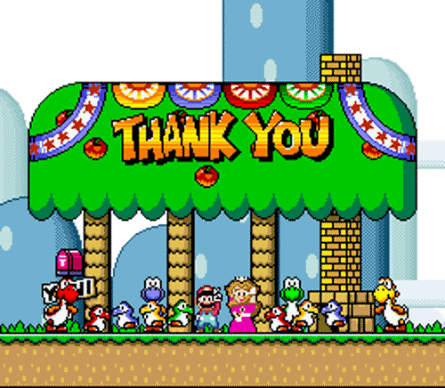

<!-- .slide: data-background="../reveal.js/img/title.png" class="center" -->

# Deep Dive on How ArcGIS API for JavaScript Widgets Were Built

### Matt Driscoll – [@driskull](https://twitter.com/driskull)
### JC Franco – [@arfncode](https://twitter.com/arfncode)


---

# Agenda

- Prerequisites
- How we got here
- Our development lifecycle
- Widget development challenges
- Tools we use
- Resources
- Q & A

---

# Prereqs: Accessor

- [Accessor SDK](https://developers.arcgis.com/javascript/latest/guide/implementing-accessor/index.html) `esri/core/Accessor`

---

# Prereqs: TypeScript

- Leverage ES6 (syntactic sugar)
- Interfaces
- Typing
- `const` and `let` vs `var`
- remove binding for `() => {}`
- [TypeScript Setup](https://developers.arcgis.com/javascript/latest/guide/typescript-setup/index.html)

---

# How we got here

- 3.x
  - Dojo Dijit
  - Dijit Themes
- 4.x
  - Abstracted & framework independent
  - ViewModels

---

# Why?

- Framework independent
- Customizable themes
- Responsive
- Redesigned API
- consistent with core API

---

# Our development lifecycle

How do we go about developing widgets?


---

# Development lifecycle

- API design
- Kickoff UI/UX design
- Develop ViewModel
- Develop View
- Write tests
- Pull request
- API merge!!!

---

# Development lifecycle: API Design

- Widget developer writes objective for widget
  - [Sample](pdf/popup-api.pdf)
- Widget dev defines API in markdown
  - View & ViewModel
    - Properties
    - Methods
    - Events
  - sample code snippets
  - demos
  - Q & A
- API reviewed and tweaked
- JS doc written and approved

---

# Development lifecycle: ViewModel

- friendly, consistent naming
- public methods
  - return types 
  - arguments
- public properties

---

# Development lifecycle: View

- Research dom structure needed for widget
- Layout containers needed
- Using proper semantic tags for nodes
- CSS object used in JSX
- Accessible, Aria roles present if necessary
- Properties, events, methods aliased as necessary

---

# Development lifecycle: Styles

- Classes needed
- BEM naming of classes
- 4x Widgets can use flexbox for layout
- Sass mixins needed?

---

# Development lifecycle: UI/UX Design

- Meeting with our creative lab
- Discuss needs, API
- Collaborate on design and tweak JSX as necessary
- Receive mockup/wireframes/assets/Sass
- implement design

---

# Development lifecycle: Tests

- Make sure we have tests that hit all the API
- Unit, integration, functional tests
- Methods are tested with all options and return types
- Properties behave as expected when modified
- etc.
- Screenshot tests

---

# Development lifecycle: Pull Request

- All the code changes done in a git branch
- PR is opened with all changes and tests included
- PR is reviewed and tested
- API build is successful
- Merge!

---

# Development challenges


---

# Development challenges: API Design

How things can be done differently in 4x compared to 3

- New tools
  - Collection
  - Accessor

---

# Development challenges: Real Nodes

- focusing nodes
  - storing reference to them

---

# Development challenges: JSX

- Using JSX to hide nodes
- toggling classes
- joining classes
- using es6 templates
- JSX key attribute
- accessibleHandler
- JSX storing data on attributes

---

#  Development challenges: ViewModels

- Rethinking APIs
  - More collections
  - More Accessors
  - View properties instead of events
  - readonly properties
- Support modules
  - Offloading logic where appropriate. More modular
- Autocasting

---

# Development challenges: Styling

- CSS to Sass
  - Variables
  - Theming
  - Mixins
- [SDK Guide: Styles](https://developers.arcgis.com/javascript/latest/guide/styling/index.html)
- [Sass](http://sass-lang.com/)
- [BEM](http://getbem.com/)
- [Icon font](https://developers.arcgis.com/javascript/latest/guide/esri-icon-font/index.html) / SVG

---

# Widget Theming: Sass

- CSS preprocessor
- Variables
- `@mixin` (group statements)
- `@include` - (use mixins)
- `@import` - (split up files)
- `@extend` - (inheritance)
- More power!

---

# Sass Install

- [Installing Sass](http://sass-lang.com/install)

```
sudo gem install sass
```

---

# Widget BEM

- [BEM](http://getbem.com/): Block Element Modifier
- Methodology to create reusable components
- Uses delimiters to separate block, element, modifiers
- Provides semantics (albeit verbose)
- Keeps specificity low
- Scopes styles to blocks

```css
/* block */
.example-widget {}

/* block__element */
.example-widget__input {}
.example-widget__submit {}

/* block--modifier */
.example-widget--loading {}

/* block__element--modifier */
.example-widget__submit--disabled {}
```

---

# Development challenges: Styling within View

CSS Object

```
const CSS = {
  base: "my-widget",
  title: "my-widget__title"
};
```

Object referenced in JSX

```
<div class={CSS.base}/>
  <h1 class={CSS.title}>Hello world</h1>
</div>
```

---

# Our Tools

- IDEs
- NPM
- Grunt
- Other


---

# Tools: IDEs

- Visual Studio Code
  - Plugins :D
- WebStorm

---

# Tools: Node

- Node
- NPM

---

# Tools: Tasks

- Grunt
- installing npm/grunt
- compile ts/sass


---

# Other tools

Besides an IDE and browser dev tools...

- SourceTree
- Terminal
- GitHub Enterprise
- Slack :D
- A handful of browsers
- Coffee

---

## Additional Resources

- [JavaScript Sessions at DevSummit](https://devsummit.schedule.esri.com/#search/sessions/q:javascript)
- [Documentation - 4.3](https://developers.arcgis.com/javascript/)


---

# Find this on GitHub

[GitHub Code](http://esriurl.com/deepdive)

[](http://esriurl.com/deepdive)

---

# Please Take Our Survey!

1. Download the Esri Events app and go to DevSummit
2. Select the session you attended
3. Scroll down to the "Feedback" section
4. Complete Answers, add a Comment, and Select "Submit"


---

# Questions?


---



---

<!-- .slide: data-background="../reveal.js/img/end.png" -->
